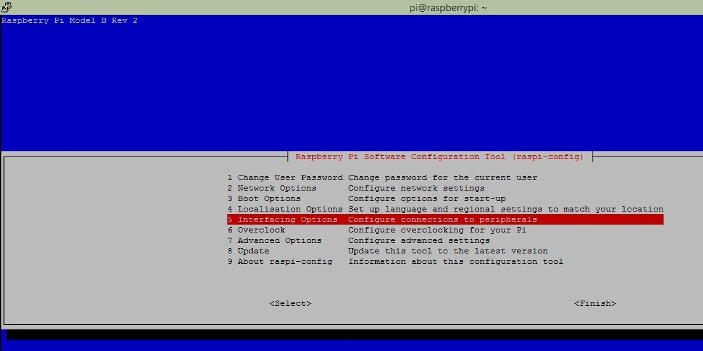

How to setup Raspberry pi using 
1. How to Format the SD Card ?
Download SD CARD FORMATTER to format the SD CARD inserted into CARD slot.

2.Select Below options and Press on Format.

3.Deleting the data in card

4.IMAGE-FILE-RASPBIAN(DEPENDS ON YOU WHICH VERSION YOU WANT TO DOWNLOAD PREFER LATEST ONE) – (https://www.raspberrypi.org/) 

5.Download Win32 Disk Imager and use to upload image file on the SD card and also connect either TP-LINK TL-WN725N wifi adapter or connect with LAN cable to router GREEN light will blink on Raspberry-pi module as shown below.

6.Uploading the downloaded Image of Raspbian.

7.Then select the Write option to write the image on SD-CARD.

8.Writing of image is in process.

9.Add ssh file to the boot SD-CARD 
1.create a text file in boot sd-card as shown in picture where the files of raspberry pi exists
2.add “you can write anything you want” to that empty text file
3.save this file as “ssh”

10.Download Who’s on my wifi and Check it out that devices connected on the Wifi  and find out on left side it will show Raspberry pi in description .

11.Download Putty and insert the IP address of Raspberry Pi in Host Name in Putty and make sure port is 22.

12.input IP address in Putty.

13.USERNAME – pi, PASSWORD -- raspberry
1.Now you are logged in the raspberry pi now you can install openCM IDE here and make connections with it .

14. To configure the camera module use command – sudo raspi-config

15.To enable the camera follow below steps.

16.Check python is installed or not ?

